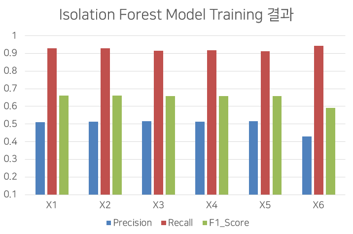
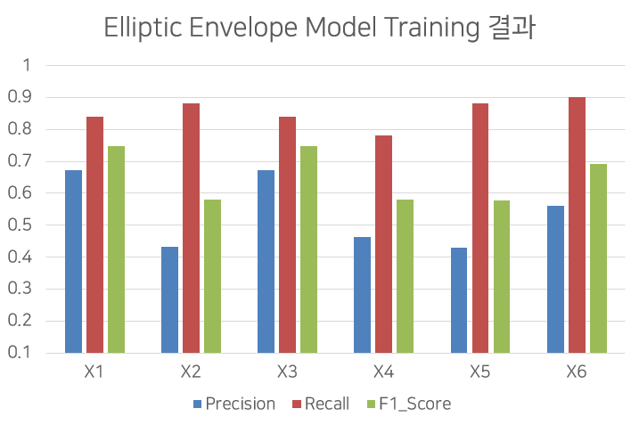

# Capstone Design 2 2022-1

## Anomaly Detection 기반 네트워크 로그 분석을 통한 악성 행위 탐지 모델 구현

### 개요

UNSW-NB15 데이터셋과 One-Class SVM, Isolation Forest, Elliptic Envelope, Local Outlier Factor 등의 Unsupervised Learning 방법론을 활용하여 Anomaly Detection 기반 악성 네트워크 로그 탐지 모델을 구현하고, 이를 평가 및 비교하는 실험을 진행하였습니다. 모델은 UNSW-NB15 Test set Feature 형식의 로그를 입력으로 받아 정상/비정상(악성) 여부를 판단합니다.

### 실험 진행 환경
테스트는 다음과 같은 환경에서 진행하였습니다.
* Python : 3.7
* CPU : AMD Ryzen 5 3600
* VGA : NVIDIA GeForce RTX 2060 Super
* OS : Windows 10

Jupyter notebook을 사용하여 실험을 진행하였으며, 모든 실험 과정은 [anomaly_detection_using_UNSW_NB15.ipynb](./anomaly_detection_using_UNSW_NB15.ipynb) 파일에서 확인하실 수 있습니다.

### 파이썬 패키지 설치
Jupyter notebook, Scikit-learn 등의 패키지를 필요로 합니다.
Python 환경 설정 후 pip를 통해 관련 패키지를 설치해 주세요.
```bash
pip install -r requirements.txt
```

### UNSW-NB15 데이터셋

UNSW-NB15 데이터셋은 정상 네트워크 트래픽과 악성 행위 네트워크 트래픽을 모두 포함한 레코드로 구성된 네트워크 침임탐지 데이터셋입니다. UNSW-NB15는 약 49개의 feature를 가진 254만 개의 레코드로 구성되어 있으며, 전체 49개 중 45개의 feature와 총 257,673개의 레코드로 구성된 머신러닝 모델 훈련/테스트용 데이터셋을 제공합니다. 이 프로젝트에서는 악성 행위 판단 모델의 훈련에 해당 훈련/테스트 데이터셋을 사용하였습니다. 원본 데이터셋과 이에 대한 자세한 설명은 [홈페이지 링크](https://research.unsw.edu.au/projects/unsw-nb15-dataset)에서 확인하실 수 있습니다.

### UNSW-NB15 데이터셋 전처리
#### Cleaning
Cleaning 단계에서는 데이터셋에 포함된 부적절한 데이터를 처리하거나 제거합니다. 먼저 UNSW-NB15 Testing Set의 Column(Feature) 중 학습 데이터 번호에 해당하는 id, 공격 카테고리에 해당하는 attack_cat, 공격 여부에 해당하는 label을 제거하였습니다. 또한 scikit-learn 모델에서는 모델 학습 시 숫자가 아닌 데이터를 입력으로 받지 않습니다. 따라서 
1. 이를 아예 제거하거나, 
2. scikit-learn의 LabelEncoder를 이용하여 데이터를 정수로 대응시키는 방법 중 하나를 선택하여 적용하였습니다.

#### Scaling
Scaling 단계에서는 데이터의 범위를 조정합니다. 머신러닝 모델은 학습에 사용한 데이터의 최솟값이나 최댓값, 혹은 분포에 의해 그 성능이 달라질 수 있습니다. 따라서 각 데이터에 Scaling을 적용하여 특정 값으로 변환하는 작업을 진행하였습니다. 이 단계에서는, 
1. 따로 Scaling을 적용하지 않거나, 
2. 각 값을 Column(Feature) 내의 최솟값과 최댓값을 기준으로 하여 0과 1 사이의 값으로 변환하는 Min-max Scaling을 적용하거나, 
3. 혹은 각 Column(Feature) 내의 값들을 평균이 0, 분산이 1이 되도록 변환하는 Standard Scaling을 적용하는 방법 중 하나를 선택하여 적용하였습니다.

#### Feature Selection
Feature Selection은 각 Feature가 분류에 미치는 중요도를 계산하고 나서 높은 것을 중심으로 선택하여 모델 학습에 적용하는 작업입니다. 그런데 Feature Selection을 진행하면 학습에 사용되지 않는 Feature가 생기므로, 일반적으로 모델의 성능이 저하됩니다. 기존 연구에서도 XGBoost와 MIMCA 등의 Feature Selection 방법을 사용하였으나 Accuracy 값이 저하된 실험 결과가 도출된 바 있습니다. 본 연구에서는 성능 향상을 중요시하여 **Feature Selection 작업을 따로 진행하지 않았습니다.**

#### Train-Test Set 분리
Train-Test Set 분리 단계에서는 scikit-learn의 train_test_split 모듈을 이용하여 데이터셋을 모델을 훈련시킬 Train Set과 성능 평가에 사용할 Test Set으로 분할합니다. UNSW-NB15는 자체적인 Train Set과 Test Set을 제공하고 있습니다. 따라서 
1. 이를 따로 분할하지 않고 사용하거나, 
2. Train set과 Test set을 병합 후 각각 75:25의 비율로 다시 분할하는 방법 중 하나를 선택하여 적용하였습니다.

2는 모델의 학습에 사용되는 정상 데이터의 수를 증가시키기 위한 방안입니다. 기존 연구에서는 랜덤 오버샘플링을 이용하여 Train set의 정상 데이터 수를 약 2배 가량 증가시키는 방안을 사용한 예가 있습니다. 그러나 이는 모델이 Overfitting될 수 있는 위험이 있어, Train Set과 Test Set을 병합 후 재분배하여 Train Set의 정상 샘플 수를 늘리는 방식을 시도하였습니다.

#### 학습용 데이터셋 생성
위 데이터셋 전처리 과정에서 제시한 방법을 조합하여, UNSW-NB15 Train set 및 Test set에서 서로 다른 전처리 과정을 거친 6개의 서브데이터셋을 생성하였습니다. 이는 아래 표에 자세히 표시하였습니다.
|Dataset|Cleaning|Scaling|Train-Test set 분리|
|---|---|---|---|
|X1|숫자 Column만 사용|-|Original Train-Test set 사용|
|X2|숫자 Column만 사용|Min-Max Scaling|Original Train-Test set 사용|
|X3|LabelEncoder 사용|-|Original Train-Test set 사용|
|X4|LabelEncoder 사용|Min-Max Scaling|Original Train-Test set 사용|
|X5|LabelEncoder 사용|Standard Scaling|Original Train-Test set 사용|
|X6|LabelEncoder 사용|-|Train set과 Test set을 병합 후 각각 75:25의 비율로 다시 분할|

### 모델 훈련 및 평가
각 데이터셋을 One-Class SVM, Isolation Forest, Elliptic Envelope, Local Outlier Factor의 4가지 모델에 학습시켰습니다. 단, Unsupervised Learning을 위해 **각 모델에는 정상 Label의 데이터만을 학습시켰습니다.** 하이퍼패러미터는 기본 값을 적용하였습니다. 또한 학습시킨 모델을 이용하여 Test Set의 각 레코드의 정상 여부를 예측하고 실제와 비교하는 성능 평가를 진행하였습니다.
모델 성능 평가에는 Confusion Matrix를 계산하고 Precision, Recall, F1-Score를 측정하여 비교하는 방식을 사용하였다. 이에 대한 설명은 아래를 참조하시길 바랍니다.

Anomaly-based IDS는 그 목적상 탐지하지 못하는 비정상 로그가 최대한 적어야 하므로 **미탐(FN)을 최소화하는 것이 가장 중요**합니다. 따라서 모델 훈련 결과는 **Recall**에 비중을 두고 평가하였습니다.

### 모델 훈련 결과
|머신러닝 기법|데이터셋|Precision|Recall|F1-Score|
|---|---|---|---|---|
|One-Class SVM|X1|0.373802229|0.517675676|0.43412926|
|One-Class SVM|X2|0.803648584|0.361945946|0.499105546|
|One-Class SVM|X3|0.373469507|0.516891892|0.433629222|
|One-Class SVM|X4|0.851116095|0.430756757|0.572013064|
|One-Class SVM|X5|0.762705903|0.351648649|0.481362955|
|One-Class SVM|X6|0.286546101|0.499526882|0.364183691|
|Isolation Forest|X1|0.511930263|0.930108108|0.660385324|
|Isolation Forest|X2|0.512346508|0.928081081|0.660219375|
|Isolation Forest|X3|0.51556909|0.915135135|0.659556854|
|Isolation Forest|X4|0.513460841|0.918567568|0.658713854|
|Isolation Forest|X5|0.516262151|0.912918919|0.659546218|
|Isolation Forest|X6|0.430053948|0.94288172|0.590690468|
|Elliptic Envelope|X1|0.673006029|0.838783784|0.746805592|
|Elliptic Envelope|X2|0.431261073|0.881567568|0.579185681|
|Elliptic Envelope|X3|0.672296566|0.839135135|0.746507658|
|Elliptic Envelope|X4|0.462728191|0.780297297|0.580946344|
|Elliptic Envelope|X5|0.430122832|0.882054054|0.578262873|
|Elliptic Envelope|X6|0.560478369|0.901032258|0.691078232|
|Local Outlier Factor|X1|0.599383751|0.888513514|0.715856633|
|Local Outlier Factor|X2|0.649576131|0.905|0.756304419|
|Local Outlier Factor|X3|0.592211513|0.860243243|0.701496485|
|Local Outlier Factor|X4|0.658437159|0.309945946|0.421485933|
|Local Outlier Factor|X5|0.519164661|0.16327027|0.248416811|
|Local Outlier Factor|X6|0.522183133|0.919311828|0.666043439|






### 결과 분석
 1. 실험 결과 전반적으로 Precision 수치가 낮고 Recall 수치가 높은 결과를 보이는 것을 확인할 수 있었습니다. 이는 오탐률이 높은 Anomaly Detection의 특징이 반영된 것으로 해석할 수 있습니다. 
 2. One-Class SVM은 다른 기법에 비해 X4 데이터셋을 학습시켰을 때 Precision이 약 0.851로 모든 결과 중 가장 높은 것을 확인할 수 있었으나, 동일 기법 적용 시 최대 Recall 수치가 X3 데이터셋 학습 시 약 0.516으로 나타나 실제 공격에 대한 미탐률이 높았습니다. 따라서 최적 모델의 후보에서 One-Class SVM은 제외하였습니다.
 3. Isolation Forest 기법을 사용한 실험은 데이터셋에 어떤 전처리 과정을 적용했는지에 상관없이 비교적 일정한 결과를 보였습니다. 이는 Feature를 무작위로 선택하고 해당 Feature 내의 최솟값과 최댓값 사이에서 랜덤으로 Split Value를 산출하는 해당 기법의 특성상 Scaling의 적용이 큰 영향을 끼치지 않기 때문으로 해석할 수 있습니다.
 4. 일반적으로 Unsupervised Learning 방식을 사용하면 학습 데이터의 크기가 증가할 시 모델의 성능 향상을 기대할 수 있습니다. 그런데 일반적인 예측과는 달리, 절대적인 학습 샘플 수가 많은 X6 데이터셋을 각 모델에 학습시켰을 때 Recall이 소폭 증가하고 반대로 Precision이 하락하여 전반적인 F1 Score는 하락하는 현상을 관찰할 수 있었습니다. 하지만 침입탐지의 관점에서 볼 때 이 사례는 오탐은 증가하였지만 미탐은 감소하였음을 의미하기 때문에 반드시 부정적인 결과는 아니라고 할 수 있습니다.
 5. Elliptic Envelope과 Local Oulier Factor를 사용한 모델에서는 공통적으로 스케일링을 적용한 모델에서 성능 지표값이 하락하는 것을 관찰할 수 있었습니다. Elliptical Envelope는 Scaling을 적용했을 때 Precision값이 다른 모델에 비해 크게 하락하였고, Local Outlier Factor는 Recall값이 다른 모델에 비해 크게 하락하였습니다. 특히 X4 데이터셋과 X5 데이터셋을 사용한 모델에서 성능 저하가 두드러졌는데, 이는 LabelEncoder를 통하여 숫자로 변환한 범주형 데이터에 Scaling을 적용한 것이 각 모델에서 분류 기준을 정하는 데 악영향을 끼친 것으로 예상됩니다.

###  최적 모델 선택 및 기존 연구와의 비교
분석 내용을 바탕으로, 실험 결과 중 최적 모델로 꼽을 수 있는 결과를 정리하고 기존 연구 결과 중 UNSW-NB15를 이용하여 이진 분류를 실행하는 모델들의 성능 지표값을 포함하여 아래 표에 나타내었습니다. 각 수치는 비교를 위해 소수 셋째자리까지 반올림하였습니다. One-Class SVM을 사용한 모델은 Recall 수치 및 F1 Score가 낮아 제외하였습니다. 아래 표에서 ConvID, RF, ANN, Decision Tree는 기존 연구에서 사용한 모델입니다.
|머신러닝 기법|데이터셋(기존 사례)|Precision|Recall|F1-Score|
|---|---|---|---|---|
|Isolation Forest|X1|0.512|0.930|0.660|
|Isolation Forest|X6|0.430|0.943|0.591|
|Elliptic Envelope|X1|0.673|0.839|0.747|
|Local Outlier Factor|X2|0.650|0.905|0.756|
|Local Outlier Factor|X6|0.522|0.919|0.666|
|ConvID|(이종화 등 4명, 2020)|0.867|0.923|0.894|
|RF|(이종화 등 4명, 2020)|0.699|0.996|0.821|
|ANN|(Kasongo 등 3명, 2020)|0.815|0.981|0.890|
|Decision Tree|(Kasongo 등 3명, 2020)|0.839|0.965|0.900|

1. 최적 모델 
각 모델의 Precision과 Recall 사이에는 Tradeoff가 존재합니다. 일례로 가장 Recall 수치가 높은 Isolation Forest와 X6을 조합한 모델의 경우 다른 모델에 비해 Precision 점수가 가장 낮습니다. 또한 반대로 가장 Precision수치가 높은 Elliptical Envelope와 X1을 조합한 모델은 Recall 점수가 가장 낮습니다. 따라서 각 결과에 일장일단이 있기 때문에 최적의 모델은 이러한 Tradeoff 관계를 고려하여 선택할 필요가 있습니다. 다만 미탐률을 최대한 줄여야 하는 IDS에서는 Recall 수치가 가장 높은 Isolation Forest 기법을 사용한 모델을 최적으로 평가할 수 있습니다.
2. 기존 연구와의 비교
본 연구의 모델들은 기존 연구에서 제시한 모델들에 비교하여 전반적으로 낮은 성능을 가집니다. 그러나 기존 연구는 모델 학습에 Label을 포함하는 Supervised Learning 방식을 사용하여 모델을 훈련하였기 때문에 Unsupervised Learning 방법론을 사용한 본 연구보다 성능이 좋은 것으로 볼 수 있습니다. 하지만 데이터셋에 포함되지 않은 유형을 탐지할 수 있다는 장점과, 모델 간의 Recall 수치를 비교하였을 때 0.1 이상의 차이가 나지 않는 점을 고려하면, 상대적으로 결과가 나쁘지 않다고 볼 수 있습니다. 다만 Precision에서 큰 차이가 나는 것을 확인할 수 있으므로 이를 개선할 수 있는 방안을 찾는 것이 중요할 것입니다.

## 결론

### 결론 및 기대 효과
UNSW-NB15 데이터셋과 One-Class SVM, Isolation Forest, Elliptic Envelope, Local Outlier Factor 등의 Unsupervised Learning 방법론을 활용하여 Anomaly Detection 기반 악성 네트워크 로그 탐지 모델을 구현하였습니다. 또한 Precision, Recall, F1-Score 등의 지표를 사용하여 구현 결과를 분석 및 평가하고, 기존 연구에서 제시한 모델과 비교하였습니다. 이를 통해 날이 갈수록 증가하는 네트워크 상에서의 악성 행위를 좀 더 효율적으로 탐지함으로써 Anomaly-based IDS의 성능 향상에 기여할 수 있을 것으로 기대합니다.

### 추후 연구 방향
향후에는 추가적으로 DBSCAN, KNN 등의 방법론을 활용하여 모델을 훈련하고, 기존 연구와 비교하는 작업을 거쳐 더 나은 결과를 얻을 수 있도록 할 계획입니다. 또한 MaxAbsScaler, RobustScaler 등의 다른 Scaling 방법과 본 연구에서 고려하지 않은 샘플링 기법 등을 적용, 더욱 다양한 전처리 과정을 거친 데이터셋을 만들고 보다 좋은 성능을 가지는 모델을 얻기 위해 연구하려 합니다.

### 참고 문헌

- Panos Panagiotou, Notis Mengidis, Theodora Tsikrika, Stefanos Vrochidis, and Ioannis Kompatsiaris. "Host-based Intrusion Detection Using Signature-based and AI-driven Anomaly Detection Methods." Information & Security 50.1 (2021): 37-48.
- N. Moustafa and J. Slay, "UNSW-NB15: a comprehensive data set for network intrusion detection systems (UNSW-NB15 network data set)." 2015 Military Communications and Information Systems Conference (MilCIS) (2015): 1-6.
- Kasongo, Sydney M, and Yanxia Sun. "Performance Analysis of Intrusion Detection Systems Using a Feature Selection Method on the UNSW-NB15 Dataset." Journal of Big Data 7.1 (2020): Journal of Big Data, 2020-11-25, Vol.7 (1).
- Muhsen, Atheer R, Ghazwh G Jumaa, Nadia F. AL Bakri, and Ahmed T Sadiq. "Feature Selection Strategy for Network Intrusion Detection System (NIDS) Using Meerkat Clan Algorithm." International Journal of Interactive Mobile Technologies 15.16 (2021): 158-71.
- 이종화, 방지원, 김종욱 and 최미정. "데이터의 불균형성을 제거한 네트워크 침입 탐지 모델 비교 분석." KNOM Review 23, no.2 (2020) : 18-28.
- 이대범 and 서재현. "특징선택 기법에 기반한 UNSW-NB15 데이터셋의 분류 성능 개선." 한국융합학회논문지 10, no.5 (2019) : 35-42.doi: 10.15207/JKCS.2019.10.5.035
